

<!-- ===== TITLE SLIDE ===== -->

<!-- _class: lead -->
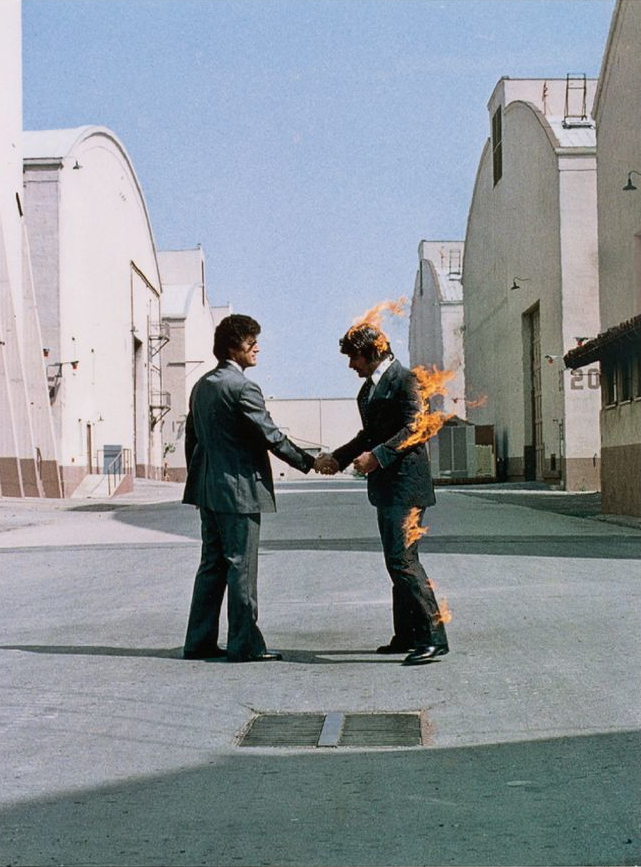

# You received a leak, now what?

**A hands-on OPSEC simulation**

<small>

Alex Pyrgiotis 
Freedom of the Press Foundation

Kolja Weber 
FlokiNet

</small>

---

## Aspects of a tip

### 1. First contact
How sources learn where to send tips.

### 2. GrapheneOS + Signal = ❤️
Hardening the mobile tipline

### 3. Perimeter security
Walls have ears, we have gears.

### 4. QubesOS + SecureDrop = ❤️
Compartmentalization as a defense.

### 5. Post-verification
Store it, share it, publish it, without burning your source.

---

<!-- _class: section-bg -->

# Part I

## The first-contact problem
*How sources learn where to send tips.*

---

<!-- _class: story -->
## The tipline situation in 2013

In 2013, an anonymous user contacted Micah Lee, then staff technologist at EFF
and CTO at Freedom of the Press Foundation:

From: anon108@■■■■■■■■■
To: Micah Lee
Date: Fri, 11 Jan 2013

Micah,

I’m a friend. I need to get information securely to **Laura Poitras** and her alone, but I can’t find an email/**gpg** key for her.

Can you help?

Source: [The Intercept —  Ed Snowden Taught Me To Smuggle Secrets Past Incredible Danger. Now I Teach You. ](https://theintercept.com/2014/10/28/smuggling-snowden-secrets/)

---

<!-- _class: story -->
## The tipline situation in 2013

That person was paranoid enough about security that even though they acquired
Laura's PGP key, they proposed Micah to tweet it, just to be sure.

From: 303@riseup.net
To: Micah Lee
Date: Mon, 28 Jan 2013

Hey Micah,
This is **Laura Poitras**.
Someone is trying to verify my fingerprint to this email. The person has proposed you **tweet the fingerprint**. Would you be able to tweet this to your acct:
**1EBF 5F15 850C 540B 3142 F158 4BDD 496D 4C6C 5F25**
Let me know if possible.
Thanks,
Laura

---

---

<!--[> _class: story <]-->
<!--## The tipline situation in 2013-->

<!--(maybe skip this)-->

<!--
-->

<!--From: **Laura Poitras**-->
<!--To: Micah Lee-->
<!--Date: Thu, 9 May 2013-->

<!--I’m working on something with **Glenn** and I really need to get him on a secure (preferably **Tails**) system. He does not have the technical skills to set this up himself, and I’m trying to keep things compartmentalized, so I don’t want to email him about this topic directly on a non-secure channel.-->

<!--
-->

<!------->

<!-- _class: lead -->
:quality(50)/2016/08/23/citizen1.jpg)

Would you go through those hoops?

---

<!-- _class: lead -->
:quality(50)/2016/08/23/citizen1.jpg)

---

<!-- _class: story -->
## Tiplines must be advertised to everyone

### Washington Post - Blended with the news articles

Source: [Promoting Your SecureDrop Instance](https://docs.securedrop.org/en/stable/admin/deployment/getting_the_most_out_of_securedrop.html)

---

<!-- _class: story -->

 
 
 
Yes, even in print.
 
 
 
 
 
 
 
 

Source: [Promoting Your SecureDrop Instance](https://docs.securedrop.org/en/stable/admin/deployment/getting_the_most_out_of_securedrop.html)

---

## The tipline landing page

What IT should know:

- **No subdomains:** use `newsroom.org/tips` not `tips.newsroom.org`
- **No analytics:** no trackers, zero logs
- **Tor-friendly** no captchas, no Javascript
- **Trustworthy hosting provider:** censorship-resistant, zero logs

---

## The tipline landing page

What sources should know:

- **Not from work:** no corporate devices, no corporate network
- **Public spaces:** cafes, libraries, anywhere not associated with you
- **Files have fingerprints:** leaked files may get traced back to you
- **Instructions:** how to securely use Signal/SecureDrop/etc.
- **Loose lips sink ships:** never discuss whistleblowing activities

---

<!-- _class: story -->
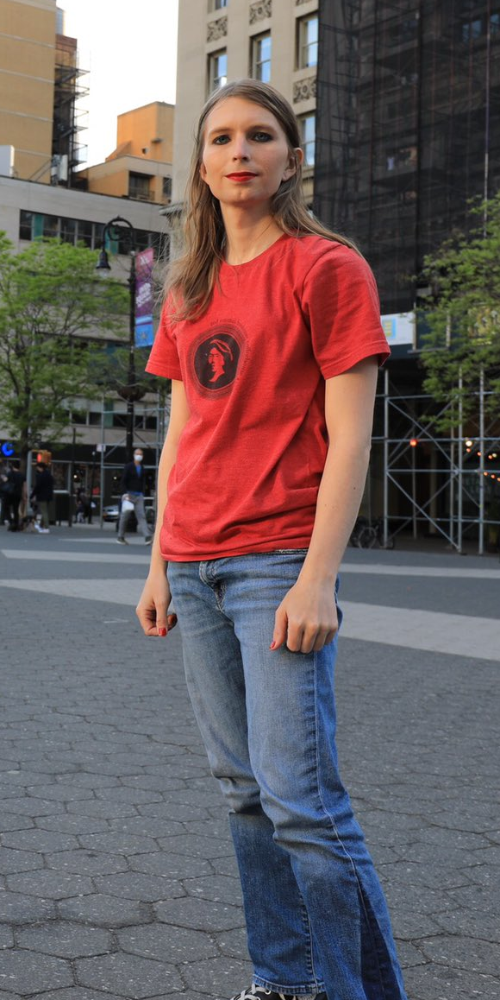

## Chelsea Manning: what can go wrong

In 2010, Chelsea Manning was leaking classified documents. She felt isolated and confided in Adrian Lamo, a former "grey hat" hacker, via encrypted chat.

Manning wrote: "but im not a source for you ... im talking to you as someone who needs moral and emotional fucking support", and Lamo replied: "i told you, none of this is for print."

Spoiler alert: it was.

Source: [Wikipedia — Chelsea Manning](https://en.wikipedia.org/wiki/Chelsea_Manning#Manning_and_Adrian_Lamo)

---

<!-- _class: story -->

## Where do we go from here?

A lot of things can go wrong. A lot of things can go right, as we learned from the now distant 2013.

In 2026, we have new tools and more experience.

Let's go **deeper**.

---

<!-- _class: section-bg -->
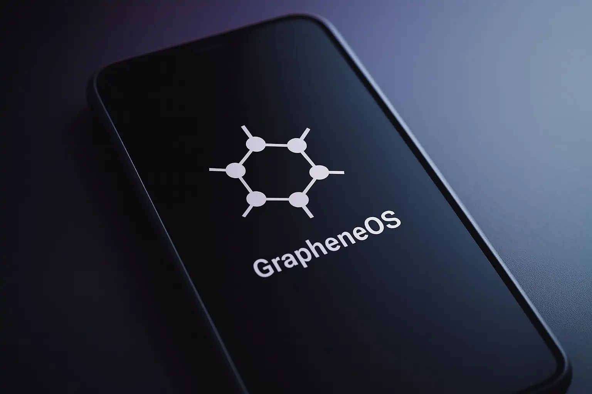

# Part II

## GrapheneOS + Signal = ❤️
*Hardening the mobile tipline*

---

## What Signal knows about you

- **Phone number:** Used to fight spam, switch devices, contact discovery
- **IP address:** The IP address of your device
- **Ephemeral keys:** Identifiers of your device and the devices you send messages to
- **Registration PIN:** If you have enabled registration lock

If Signal (or AWS) was malicious, it would theoretically track who's talking
with who, based on IPs and ephemeral keys.

---

## Quick Signal wins

| Setting | Why it matters |
|---------|----------------|
| **Sealed sender** | Harder for Signal/AWS to track who talks with whom |
| **Disable link previews** | Previews = IP leak to the server behind the link |
| **Registration lock** | Blocks SIM-swap hijacking |
| **No notification content (iOS-only)** | Do not store incoming messages to device |

---

## Registration lock

- Signal numbers can switch to a different device (think lost/broken phones).
- Sole requirement is to have ownership of phone number (but law enforcement also can).
- Registration lock means that you can't do it, unless you remember a PIN.
- Prevents recent phishing attacks against journalists:

Source: [Netzpolitik — Phishing](https://netzpolitik.org/2026/phishing-attack-numerous-journalists-targeted-in-attack-via-signal-messenger/)

---

## iOS notifications

- iOS stores all your notifications locally, with no way to disable it.
- FBI used this avenue to partially restore Signal messages (even deleted ones).

Source: [Forbes — FBI](https://netzpolitik.org/2026/phishing-attack-numerous-journalists-targeted-in-attack-via-signal-messenger/)

---

## FBI doesn't always win

(something about not getting round the phone)

Source: [404 Media— Lockdown]()

---

## How Cellebrite works

(image of Cellebrite device on the right)

Important terms:
- **BFU:** "Before First unlock", i.e., device powered off or just booted
- **AFU:** "After First unlock", i.e., device has been unlocked at least once
- **TPM:** "Trusted Platform Module", an onboard-chip that prevents PIN guessing
  - Available on iOS and certain Android devices.

(show image of TPM)

---

(full picture of device that Cellebrite can unlock)

---

## Quick phone wins

| Setting | Why it matters |
|---------|----------------|
| **Lockdown mode (iOS)** | Protection against device seizures/spyware |
| **Advanced Protection (Android)** | Protection against device seizures/spyware |
| **No SIM card (newsroom devices)** | lots of 0-days target SMS/MMS |

---

## GrapheneOS

| Setting | Why it matters |
|---------|----------------|
| **Auto-reboot** | Brings device to BFU if not unlocked for `N` hours |
| **Disable USB port on lock screen** | Prevents software bugs |
| **No/sandboxed Google Play** | Makes Google integration smaller |
| **User profiles** | Compartmentalization as a defense |
| **Hardware attestation** | Protection against evil-maid attacks |
| **Duress password** | Wipe device in case of physical intimidation |

---

## Live demo: GrapheneOS + Signal

- Simple installation
- User profiles (personal, tips, vaults)
- Receiving a tip via Signal
- Device VPN (Orbot)
- Secure PDF viewer / browser

---

# Part III

## Perimeter security
*Walls have ears, we have gears.*

---

# Part IV

## QubesOS + SecureDrop = ❤️
*Compartmentalization as a defense.*

---

## Remember that WaPo reporter?

- Mention that Macbook of WaPo reporter was compromised.
- Signal can be subpoenaed to reveal phone numbers
- Opening files with attachments can be very dangerous.

---

## Fake whistleblowers

(mention ICIJ story)

---

## SecureDrop overview - Sources

- Sources visit Tor site, receive a long codename
- Sources can send messages, attachments
- Sources can learn about replies only if they visit again

(add picture of Tor landing page)

---

## SecureDrop overview - Journalists

- Journalists have two laptops and four USB keys.
- Download submissions over Tor from one laptop.
- Decrypt submissions in other offline laptop.
- Reply back to the user from original laptop.

(add picture of two laptop airgap)

---

## SecureDrop woes

- Upfront money investment (NUCs, laptops, router, USBs, IT person, physical space)
  - The newsroom is getting more virtual by the day.
- Journalist time investment: lots of passwords and keys to juggle, lots of
  spam, infrequent communication
- Freedom of the Press Foundation is working hard on fixing these problems:
  - Ditch NUCs in favor of end-to-end encrypted protocol with centralized server.
  - Ditch multiple laptops and Tails keys in favor of a single laptop.

---

## Qubes OS

- Linux
- Targeted at technical users
- Everything is a VM
- Compartmentat

---

## Live Demo: QubesOS + SecureDrop

- Compartmentalization
- Safe file viewing and printing
- Search messages, export transcripts

---

<!-- _class: section-bg -->

# Part V

## Post-verification
*Store it, share it, publish it, without burning your source.*

---

<!-- _class: story -->

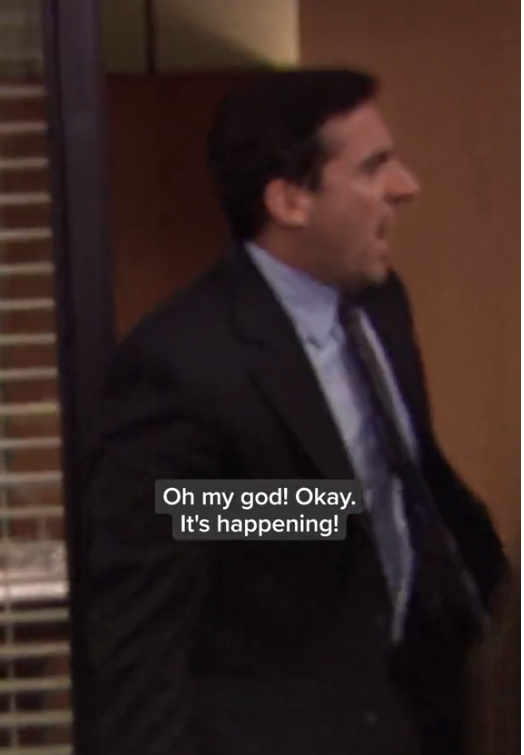

## Post-verification

You have verified in a secure fashion that the material is important.

Possible scenarios:
- **Store it**
- **Share it privately**
- **Go public**

---

<!-- _class: story -->

## Store it offline

Use [Veracrypt](https://veracrypt.io) on any USB drive!

- Available on Windows/macOS
- Third-party support on Android/iOS
- Open-source
- Offers plausible deniability

---

<!-- _class: story -->

## Plausible deniability

A Veracrypt drive can consist of two volumes:
- **Outer volume:** Place decoy files in there (tax / health records, previous
  investigations).
- **Inner (hidden) volume:** Place sensitive files in there.

In duress, offer the password of the **outer volume**.

---

<!-- _class: story -->

## Making it tamper-evident

In cases of:
- Shipping USB drive to someone
- Crossing borders
- Long-term storage

Source: [dys2p.com — Random Mosaic – Detecting unauthorized physical access with beans, lentils and colored rice](https://dys2p.com/en/2021-12-tamper-evident-protection.html#manipulation-auf-dem-versandweg)

---

<!-- _class: section-bg -->

#### Here's Micah's "flash drive gift" to Glenn Greenwald.

Source: [The Intercept —  Ed Snowden Taught Me To Smuggle Secrets Past Incredible Danger. Now I Teach You. ](https://theintercept.com/2014/10/28/smuggling-snowden-secrets/)

---

<!-- _class: section-bg -->

---

## Making it tamper-evident (the boring way)

One way is to buy tamper evident bags...

---

<!-- _class: story -->

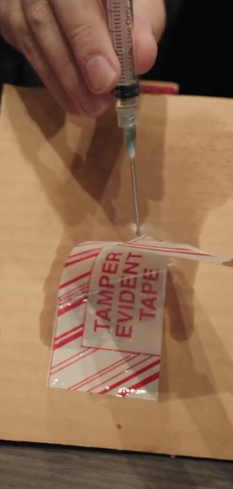

... but if your threat model is law enforcement, assume that they have ways around it.

<small>

_(here, it's just a syringe with acetone)_

</small>

Source: [DEF CON 30 - Tamper Evident Village ](https://www.youtube.com/watch?v=slhdowWjSuU)

---

<!-- _class: story -->

## Making it tamper-evident (the fun way)

1. Grab a bean mix
2. Wrap the USB drive with plastic wrap
3. Put the beans and the USB drive in a vacuum bag
3. Seal it with a vacuum sealer
4. Take a picture of it from both sides
5. Verify the mosaic with [BlinkComparison](https://play.google.com/store/apps/details?id=org.proninyaroslav.blink_comparison) (Android-only)

Source: [dys2p.com — Random Mosaic – Detecting unauthorized physical access with beans, lentils and colored rice](https://dys2p.com/en/2021-12-tamper-evident-protection.html#manipulation-auf-dem-versandweg)

<small>

_Showcase of how blink comparison works_

</small>

---

## Store it online

- [Proton Drive](https://proton.me/drive) offers end-to-end encryption.
- For the paranoid, you can even create an anonymous account using Tor.

---

## Going public

The material may have de-anonymization vectors that point back to the source.

Let's see some prominent examples.

---

<!-- _class: story -->
## Exhibit A - Simple metadata (multimedia)

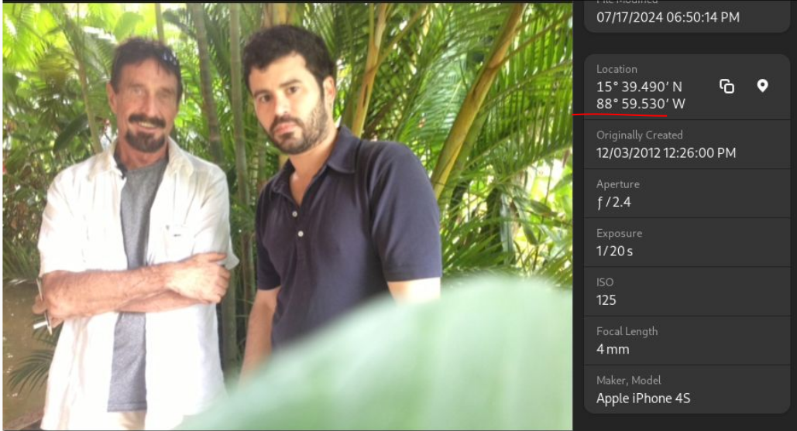

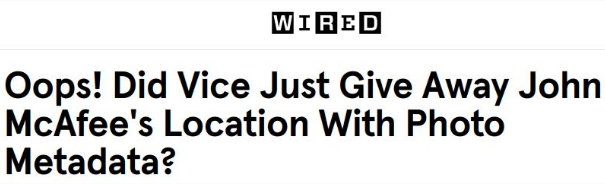

⚠Photos may contain location and author info

Source: [Wired — Oops! Did Vice Just Give Away John McAfee's Location With Photo Metadata?](https://www.wired.com/2012/12/oops-did-vice-just-give-away-john-mcafees-location-with-this-photo/)

---

<!-- _class: story -->
## Exhibit B - Complex metadata (PDF, MS Office)

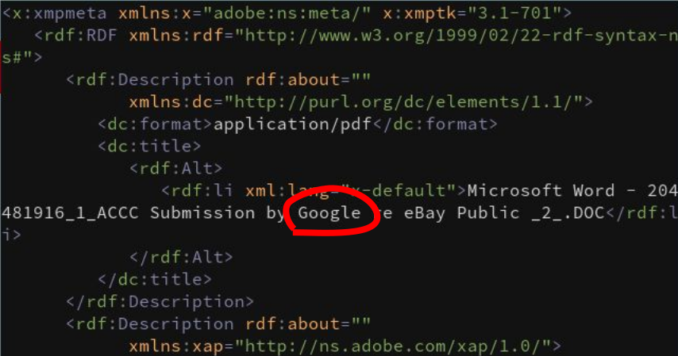

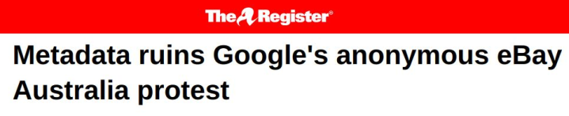

⚠ PDFs and office documents may contain nested metadata.
Think embedded photos, Word’s tracking changes feature.

Source: [The Register — Metadata ruins Google's anonymous eBay Australia protest](https://www.theregister.com/on-prem/2008/05/30/metadata-ruins-googles-anonymous-ebay-australia-protest/1285606)

---

<!-- _class: story -->
## Exhibit C - Redactions

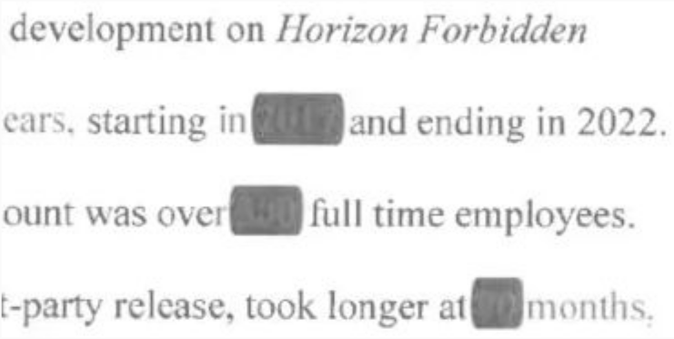

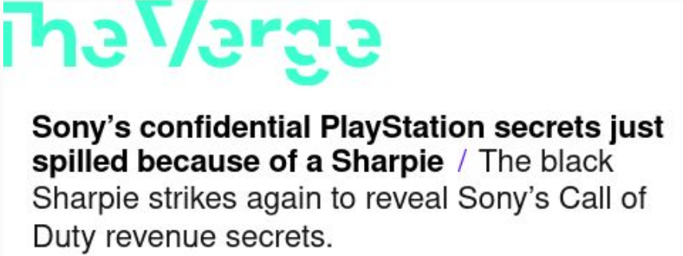

⚠ Redactions do not work if in a layer or not opaque

Source: [The Verge — Sony’s confidential PlayStation secrets just spilled because of a Sharpie](https://www.theverge.com/2023/6/28/23777298/sony-ftc-microsoft-confidential-documents-marker-pen-scanner-oops)

---

<!-- _class: story -->
## Exhibit D - Physical watermarks

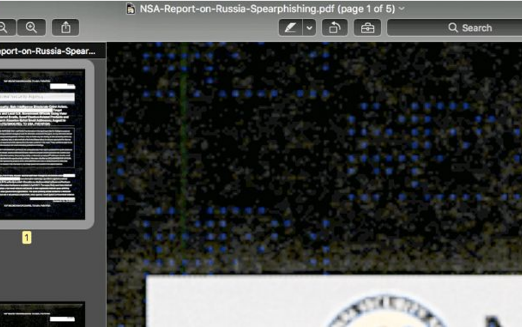

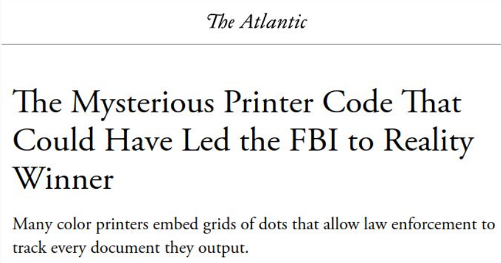

⚠ Printed documents may contain tracking dots

Source: [The Atlantic — The Mysterious Printer Code That Could Have Led the FBI to Reality Winner](https://www.theatlantic.com/technology/archive/2017/06/the-mysterious-printer-code-that-could-have-led-the-fbi-to-reality-winner/529350/)

---

<!-- _class: story -->
## Exhibit E - Digital watermarks

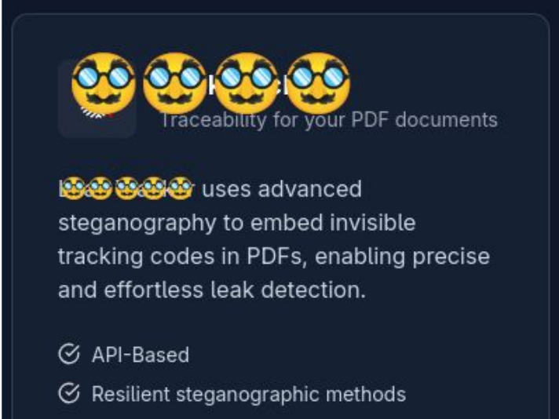

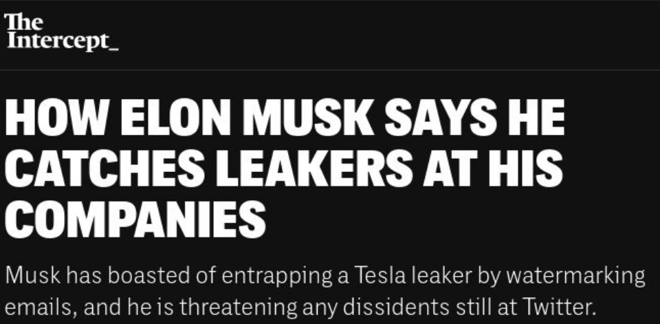

⚠ Digital material accessible only to you may have invisible watermarks

Source: [The Intercept — How Elon Musk Says He Catches Leakers at His Companies](https://theintercept.com/2022/12/15/elon-musk-leaks-twitter/)

---

<!-- _class: story -->
## Exhibit F - Canary tokens

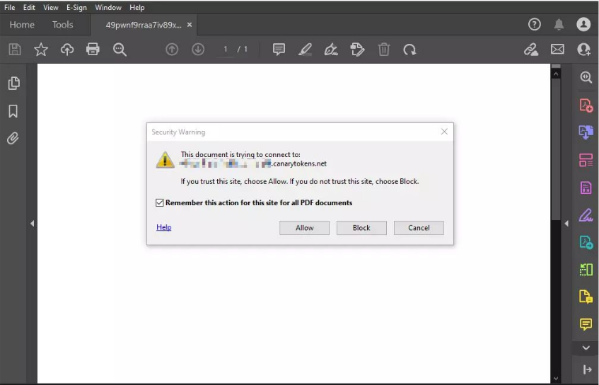

- Most sane document viewers block them silently.
- Microsoft Office asks to enable macros.
- Adobe Acrobat asks if it's ok to connect to site.
- Deanonymization is a click away.

⚠ Trapped documents may phone home in major viewers

Source: [Austin Martin — Canary Tokens](https://blog.amartinsec.com/blog/canary/)

---

<!-- _class: story -->
## Exhibit G - Fingerprinting

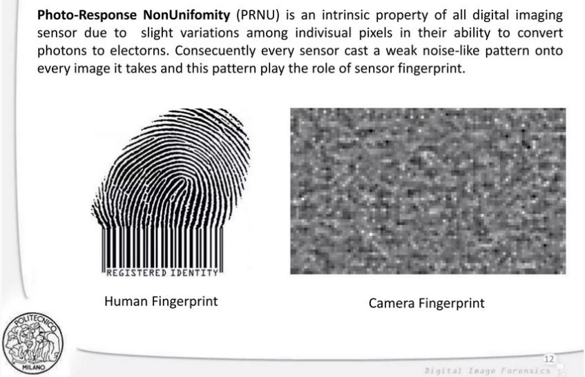

- Cameras, mics are subject to fingerprinting
- Your way of writing is a fingerprint (stylometry)
- Unlike watermarking, fingerprinting is useful only with a second match (much like human fingerprints)

⚠ A/V equipment and writing style can be fingerprinted

Source: [Digital Image Forensics: Camera Fingerprint and its Robustness](https://www.slideshare.net/slideshow/digital-image-forensics-camera-fingerprint-and-its-robustness/15069696)

---

<!-- _class: story -->
## Exhibit H - Environment

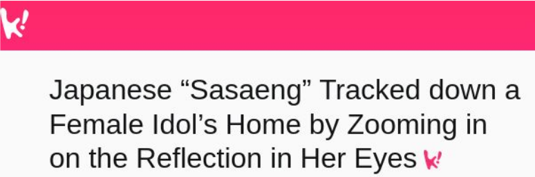

⚠ Cameras, microphones capture the surrounding environment

Source: [Koreaboo — Japanese “Sasaeng” Tracked down a Female Idol’s Home by Zooming in on the Reflection in Her Eyes](https://www.koreaboo.com/stories/matsuoka-ena-sasaeng-obsessed-fan-idol-stalker-photo-eyes-reflection/)

---

## Going public

Practical advice:
- Ensure that the source used **disposable equipment** not tied to them.
- Ensure that the documents were **not directed** to the source.
- Sanitize documents before publication:
  - [Dangerzone](https://dangerzone.rocks/) (GUI)
  - [MAT2](https://github.com/jvoisin/mat2) (CLI-only)

---

<!-- _class: story -->

## OPSEC works!

[KRIK](https://www.krik.rs) protected their source by not providing the prosecutors office with the original recording of an incriminating discussion.

In its latest letter to KRIK, the prosecutor’s office claims the recording is needed for forensic examination and insists it is not asking the newsroom to reveal its source, only to **provide the recording itself — either the original, its “closest copy,” or the device on which it was recorded.** The letter again threatens journalists with a **fine if they fail to comply**.

Source: [OCCRP —  Serbian Prosecutors Threaten KRIK with Fine if it Fails to Submit Recording of a Conversation ]()

---

<!-- _class: story -->

## OPSEC works!

[Radio New Zealand](https://www.rnz.co.nz) protected their source by not disclosing the document format that the source provided to them.

[...] the investigator interviewed more than **40 people** including those who accessed the Budget report **"via SharePoint"**, received a copy of the report as an **email attachment**, or **had printed it**. [...] It was unclear which version the reporter had seen.

The Investigator asked to speak to the RNZ reporter [...] to discuss matters such as **the file format and version of the Budget Report disclosed to him**. The reporter and Radio New Zealand via its legal representation declined to do so.

Source: [Radio New Zealand — Ministry of Education's $20,000 inquiry fails to find Budget leak to RNZ](https://www.rnz.co.nz/news/national/574602/ministry-of-education-s-20-000-inquiry-fails-to-find-budget-leak-to-rnz)

---

**Thank you**

Questions? OPSEC war stories?
